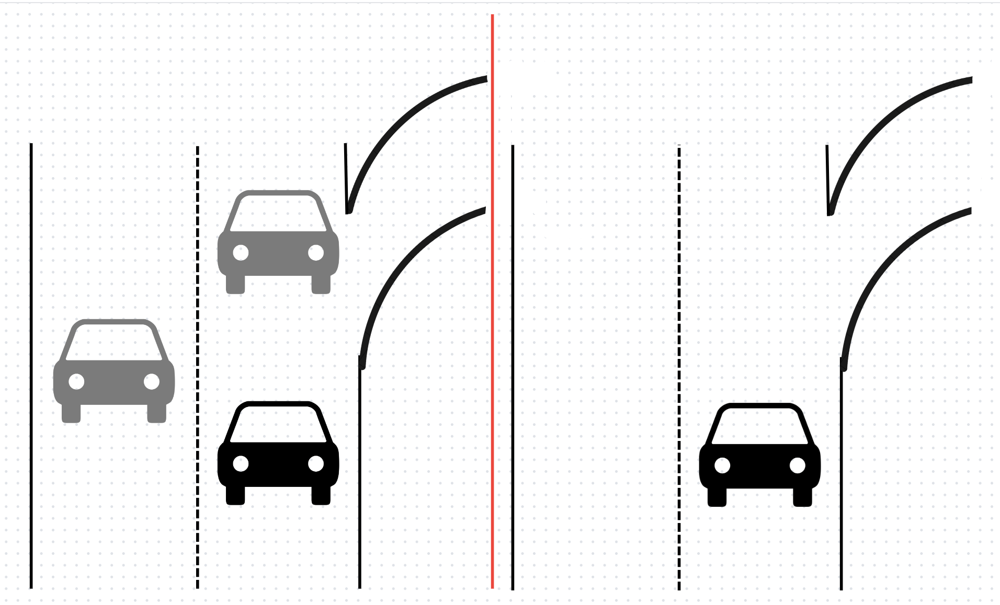
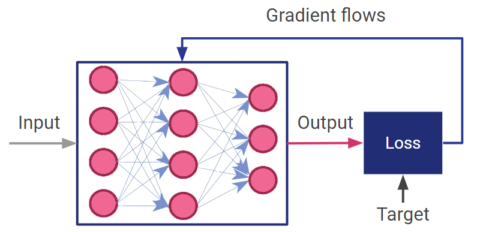
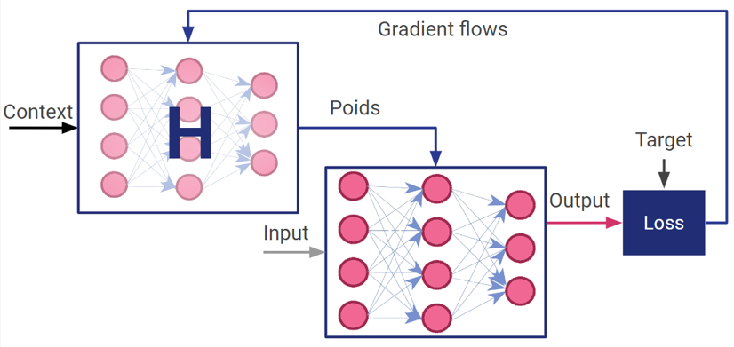
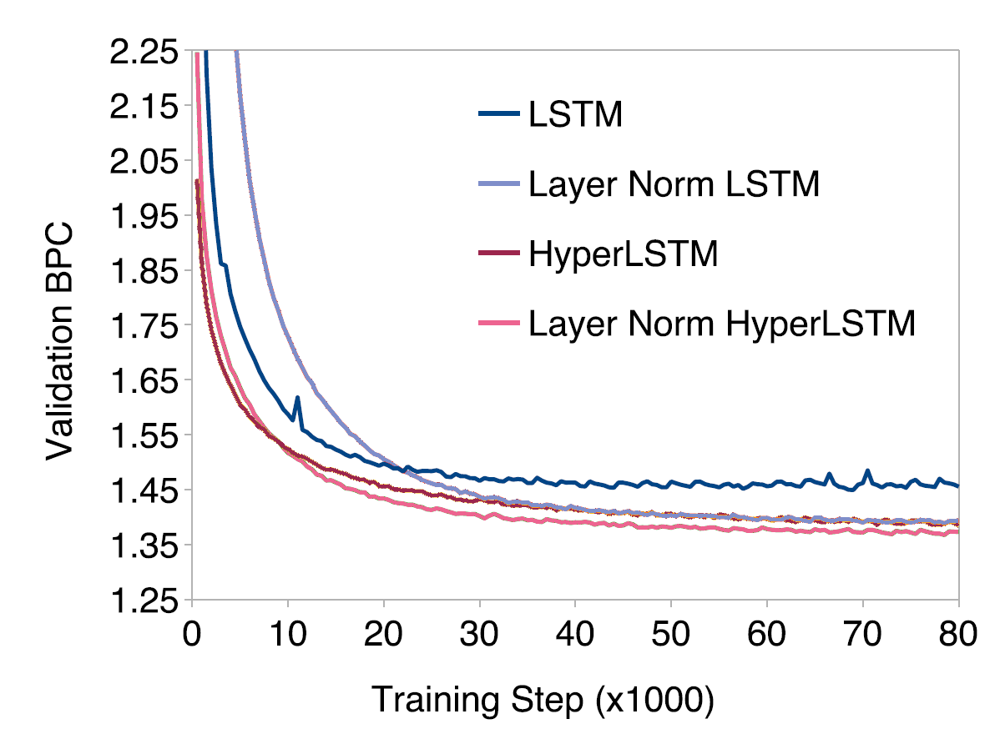
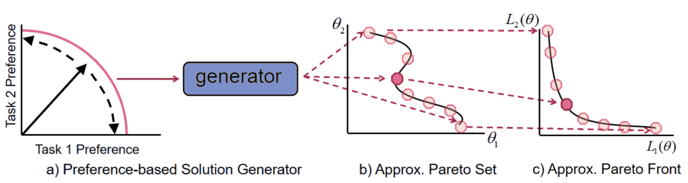
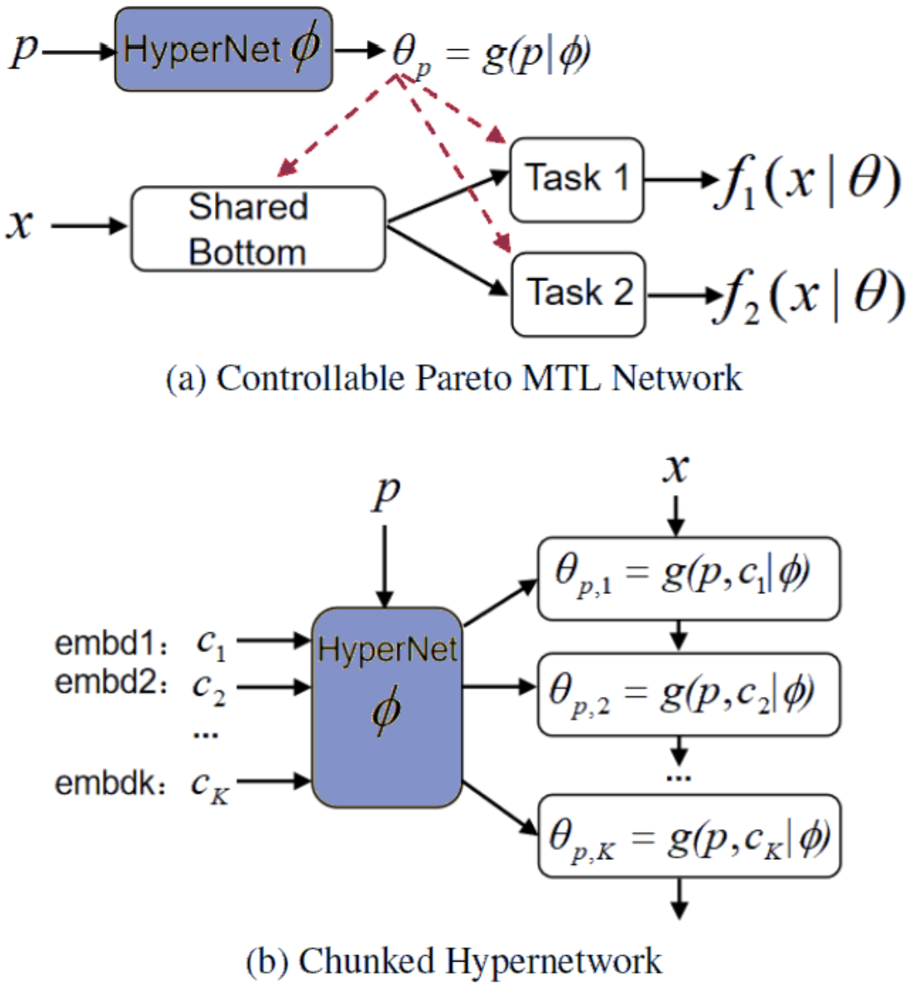
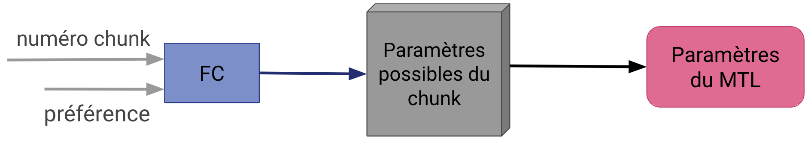
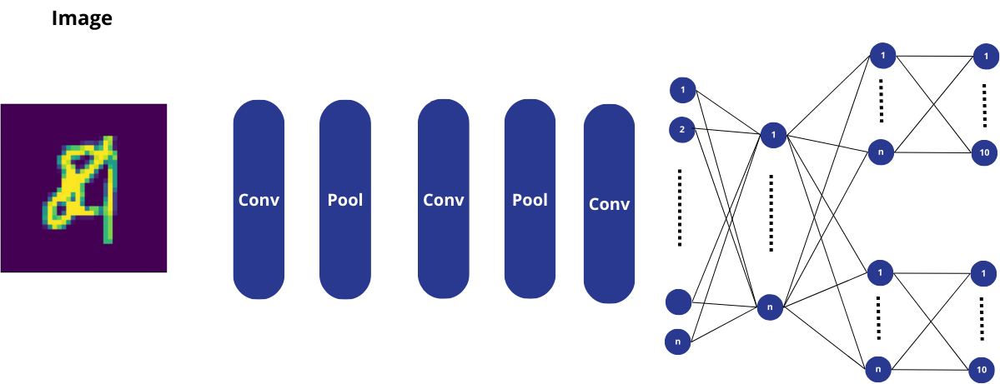
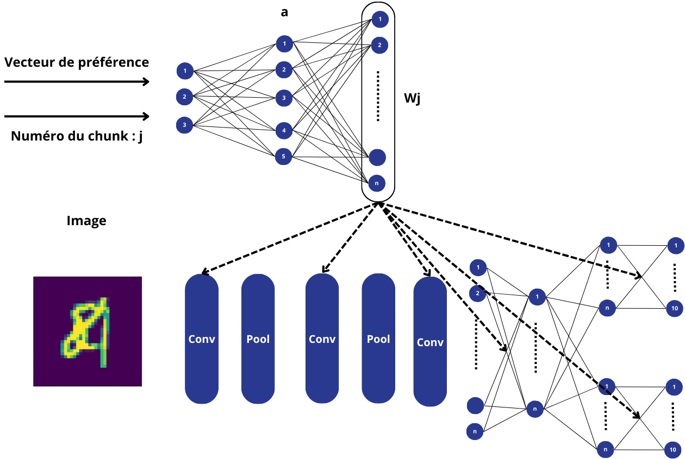

# Masteriales : Projet 2

**Hélène de Foras, Nabil Ait Said, Victor Lemaire, William Brebion**  
Janvier 2024

---

## Table des matières

- [Introduction](#introduction)
- [Résumé des articles](#résumé-des-articles)
  - [A Brief Review of HyperNetworks in Deep Learning](#a-brief-review-of-hypernetworks-in-deep-learning-chauhan2023brief)
    - [Exemple de fonctionnement d'un hypernet](#exemple-de-fonctionnement-dun-hypernet)
    - [Les hypernetworks et leurs avantages](#les-hypernetworks-et-leurs-avantages)
    - [Apprentissage du front de Pareto](#apprentissage-du-front-de-pareto)
  - [HyperNetworks](#hypernetworks-ha2016hypernetworks)
    - [Hypernetworks statiques](#hypernetworks-statiques)
    - [Hypernetworks dynamiques](#hypernetworks-dynamiques)
  - [Controllable Pareto Multi-Task Learning](#controllable-pareto-multi-task-learning-lin2021controllable)
    - [Un MTL pour un problème multi-objectif](#un-mtl-pour-un-problème-multi-objectif)
    - [Ensemble et Front de Pareto](#ensemble-et-front-de-pareto)
    - [Le générateur de l'ensemble de Pareto](#le-générateur-de-lensemble-de-pareto)
  - [Learning the Pareto Front with HyperNetworks](#learning-the-pareto-front-with-hypernetworks-navon2021learning)
- [Adaptation du modèle au dataset](#adaptation-du-modèle-au-dataset)
  - [CNN multitâches](#cnn-multitâches)
  - [CNN avec hypernetwork](#cnn-avec-hypernetwork)
    - [Procédure d'entrainement](#procédure-dentrainement)
  - [Expérimentations et résultats](#expérimentations-et-résultats)
  - [Hyperparamètres](#hyperparamètres)
  - [Résultats](#résultats)
- [Conclusion](#conclusion)

---

## Introduction

L'objectif du projet est d'étudier l'approche présentée dans l'article [*Controllable Pareto Multi-Task Learning*](https://arxiv.org/pdf/2010.06313). Pour cela, les articles [*A Brief Review of Hypernetwork in Deep Learning*](https://arxiv.org/pdf/2306.06955), [*Hypernetworks*](https://arxiv.org/pdf/1609.09106) et [*Learning the Pareto Front with Hypernetworks*](https://arxiv.org/pdf/2010.04104) nous ont été fournis. Le but est de réduire la mémoire demandée par un modèle multi-objectifs en utilisant des hypernetworks. Ceux-là peuvent être utiles quand on a un système où la mémoire est limitée et/ou avec un choix d'importance d'objectifs pouvant être variable. Notamment pour un système de conduite autonome d'une voiture qui pourrait devoir choisir, en fonction des conditions, entre détecter une voiture et une sortie.  
Nous avons pour cela commencé par lire les articles fournis pour comprendre tous les aspects du projet. Étant donné qu'aucun code n'était fourni, nous avons dû coder entièrement le réseau de neurones en essayant au maximum de respecter ce qui était décrit dans l'article [*Controllable Pareto Multi-Task Learning*](https://arxiv.org/pdf/2010.06313) pour ensuite pouvoir comparer nos résultats avec les leurs. Nous avons ensuite essayé de coder l'hypernetwork, malheureusement sans succès à cause de nombreux problèmes que nous détaillerons ensuite.

## Résumé des articles

### [*A Brief Review of Hypernetwork in Deep Learning*](https://arxiv.org/pdf/2306.06955)

Les hypernetworks sont des réseaux de neurones qui génèrent des poids pour un autre réseau de neurone, connu comme réseau cible. Ils ont émergé comme une puissante technique de deep learning qui permet une meilleure flexibilité, adaptabilité, dynamisme, entraînement plus rapide, partage d'information et compression de modèles. Les hypernets ont montré des résultats prometteurs dans une variété de problèmes du deep learning incluant l'apprentissage continu, l'inférence causale, le transfert d'apprentissage, l'élagage de poids, la quantification de l'incertitude, zero-shot learning, natural langage processing, et l'apprentissage par renforcement. Malgré leur succès, il n'y a pas de revue disponible pour informer et aider les chercheurs du développement des hypernets. Pour combler ce vide, l'article fait une revue des progrès des hypernets. L'article présente un exemple illustré pour entrainer les réseaux de deep learning en utilisant les hypernets et propose une catégorisation des hypernets basée sur cinq critères de design : entrée, sortie, variabilité des entrées/sorties et architecture des hypernets. L'article fait aussi une revue de l'application des hypernets à travers différents problèmes de paramètres du deep learning, suivi d'une discussion des scénarios généraux où les hypernets peuvent être employé. Enfin, l'article parle des défis et des directions futures qui restent sous-explorées dans le champ des hypernets. Ils offrent une nouvelle façon de designer et d'entraîner les réseaux de neurones et ont le potentiel d'améliorer les performances des modèles de deep learning dans une variété de tâches.

#### Exemple de fonctionnement d'un hypernet

Dans la figure ci-dessus, input est un point d'un dataset, output est la prédiction du modèle/forward pass, target est le label de vérité et gradient flows est la backward pass. Le DNN prend donc cette entrée et son poids et passe à travers toutes les couches du DNN pour produire une prédiction, qui est ensuite utilisée avec le label de vérité pour produire une fonction objectif, mesurant l'écart entre la prédiction et la valeur réelle à l'aide d'une fonction de perte. Ensuite, durant la backward pass, le modèle utilise la rétropropagation pour propager l'erreur à travers les couches et aider à calculer le gradient de la fonction de perte en fonction du poids. Enfin, un algorithme d'optimisation, comme Adam, utilise le gradient pour mettre à jour les poids. À la fin de l'entraînement, nous avons des poids optimisés qui sont utilisés au moment de l'inférence dans le DNN pour faire des prédictions avec les données de test pour résoudre une tâche. Dans les DNN standard, les poids évoluent au fil de l'apprentissage.

Ici, la différence est que les poids du DNN ne sont pas appris, mais générés par l'hypernet. L'hypernet prend en entrée un vecteur de contexte et son poids pour générer en sortie les poids du DNN classique. Le vecteur de contexte peut être généré à partir des données, échantillonné à partir d'une distribution de bruit ou correspondre à l'identité de la tâche. Le DNN prend une entrée et les poids générés par l'hypernet pour agir comme l'exemple ci-dessus, à l'exception de la backward pass qui est retournée dans l'hypernet pour que l'erreur soit propagée dans les couches de l'hypernet et que le gradient de la fonction de perte soit calculé en fonction des poids de l'hypernet. Enfin, un algorithme d'optimisation utilise le gradient pour mettre à jour les poids de l'hypernet.

En conclusion, les DNN apprennent leurs poids directement à partir des données alors que dans les HyperDNN (DNN avec un hypernet) les poids de l'hypernet sont appris et les poids du DNN sont générés par l'hypernet.

#### Les hypernetworks et leurs avantages

Les caractéristiques et avantages clés des hypernets sont abordés ci-dessous :

- **Partage souple des poids :** Les hypernets peuvent être entrainés pour générer les poids de plusieurs DNN afin de résoudre des tâches connexes. Contrairement au partage dur des poids qui implique le partage de couches parmi les tâches (multi-tâche), ici différents DNN sont générés par un hypernet commun grâce au conditionnement des tâches. Cela permet de partager des informations entre les tâches et peut être utilisé pour l'apprentissage par transfert ou le partage dynamique d'informations.
- **Architecture dynamique :** Les hypernets peuvent être utilisés pour générer les poids d'un réseau à architecture dynamique, où le nombre de couches ou la structure du réseau change lors de l'entraînement ou de l'inférence. Cela peut être particulièrement utile pour les tâches où la structure du réseau cible est inconnue au moment de l'entraînement.
- **DNN adaptatifs aux données :** Contrairement aux DNN standard dont les poids sont fixés au moment de l'inférence, les HyperDNN peuvent être développés pour générer un réseau cible personnalisé en fonction des besoins des données. Dans ce cas, les hypernets sont conditionnés par les données d'entrée pour s'adapter aux données.
- **Quantification de l'incertitude :** Les hypernets peuvent former efficacement des DNN conscients de l'incertitude en tirant parti de techniques comme l'échantillonage d'entrées multiples à partir de la distribution de bruit ou l'incorporation de l'abandon dans les hypernets eux-mêmes. En générant plusieurs ensembles de poids pour le réseau principal, les hypernets créent un ensemble de modèles, chacun avec différentes configurations de paramètres. Cette approche basée sur l'ensemble permet d'estimer l'incertitude dans les prédictions du modèle, un aspect crucial pour les applications critiques en matière de sécurité comme la médecine, où il est essentiel d'avoir une certaine confiance dans les prédictions.

#### Minimisation du nombre de paramètres
Les HyperDNN, les DNN formés avec des hypernets, peuvent avoir moins de poids que les DNN standard, ce qui entraîne une compression de poids. Cela peut s'avérer particulièrement utile lorsque l'on travaille avec des ressources limitées, des données limitées ou lorsque l'on traite des données à haute dimension et peut entraîner une formation plus rapide qu'avec le DNN correspondant.

#### Apprentissage du front de Pareto
Il existe de nombreuses applications pour les hypernets mais celle qui nous intéresse est l'apprentissage du front de Pareto que nous allons détailler maintenant.

L'apprentissage du front de Pareto, également connu sous le nom d'optimisation multi-objectifs, est une technique qui s'attaque aux problèmes comportant plusieurs objectifs conflictuels. Par exemple, le multitâche comporte plusieurs tâches dont les gradients peuvent être conflictuels. Elle vise à trouver un ensemble de solutions qui représente le compromis entre les différents objectifs, plutôt qu'une solution optimale unique. Dans l'apprentissage du front de Pareto, le but est d'identifier un ensemble de solutions qui ne peuvent pas être améliorées pour un objectif sans sacrifier la performance pour un autre objectif. Ces solutions sont appelées solutions Pareto-optimales ou solutions non dominées et se situent sur le front de Pareto, qui représente le meilleur compromis possible entre les objectifs.

Les auteurs de [*Learning the Pareto Front with Hypernetworks*](https://arxiv.org/pdf/2010.04104) ont appliqué des hypernets pour apprendre l'ensemble du front de Pareto, qui au moment de l'inférence prend un point préférentiel sur le front de Pareto et génère des poids du front de Pareto pour le réseau cible dont le vecteur de perte est dans la direction du rayon. Ils ont montré que les hypernets proposés sont très efficaces de manière computationnelle par rapport au SOTA et qu'ils peuvent s'adapter à de larges modèles, tel que ResNet18.

### [*Hypernetworks*](https://arxiv.org/pdf/1609.09106)

L'article Hypernetworks a été écrit par Google Brain et publié en décembre 2016. 
L'objectif de ce travail est d'utiliser les hypernetworks dans les réseaux convolutifs profonds et les réseaux récurrents longs.

#### Hypernetworks statiques

Lorsque la taille des poids du réseau principal est fixée, on utilise un hypernetwork statique, dont la sortie correspond au réseau cible. Ces hypernetworks statiques sont utilisés pour générer les poids de réseaux convolutifs, dont la taille des layers est définie. Les CNNs sont souvent utilisés pour la reconnaissance d'image, c'est le cas pour les deux exemples suivants.  

Avec le jeu de données MNIST, on utilise un CNN à deux niveaux. L'état de l'art donne 99,28 % d'accuracy avec 12544 paramètres. L'hypernetwork génère les poids du deuxième niveau, et on obtient une accuracy de 99,24 %, très semblable au score sans hypernetwork. Par contre, il n'y a que 4240 paramètres dans l'hypernetwork.  

Ils développent ensuite un hypernetwork pour CIFAR-10. L'architecture du réseau principal est un réseau convolutionnel résiduel, et il y a un partage des poids relaxé. L'hypernetwork va générer 36 niveaux convolutifs. Il y a 1,25 à 1,5 % d'erreurs en plus que sans hypernetwork, mais jusqu'à 2M de paramètres en moins (sans hypernetwork, il y a 2,236 M de paramètres).  

Les hypernetworks statiques permettent donc d'avoir des bons résultats, et en utilisant beaucoup moins de paramètres.

#### Hypernetworks dynamiques

L'architecture LSTM (Long Short Term Memory) est généralement plus performante que le RNN de base pour stocker et récupérer des informations sur des périodes plus longues. On met à jour les poids du réseau principal et de l'hypernetwork avec la backpropagation.

Le jeu de données enwik8 est une séquence de 100M de caractères de Wikipédia. Le but est la prédiction de mots.

Le graphique suivant est la courbe de Loss. On remarque que les réseaux qui utilisent les hypernetworks convergent plus vite que sans hypernetwork.

Cependant, il y a 18,71M de paramètres avec l'hypernetwork, alors que le réseau qui a la meilleure accuracy a 14,81M (sans hypernetwork). Les scores sont équivalents. Ainsi, utiliser les hypernetworks permet dans ce cas de converger plus vite, mais pas d'avoir moins de paramètres comme dans le cas précédent.

### [*Controllable Pareto Multi-Task Learning*](https://arxiv.org/pdf/2010.06313)

L'article Controllable Pareto Multi-Task Learning présente une approche pour surmonter les défis du MTL résolvant un problème multi-objectif. Pour cela, les auteurs utilisent un hypernetwork qui prend une préférence de tâches et génère les poids pour le MTL. Ces derniers appartiennent à l'ensemble de Pareto pour optimiser les résultats.

#### Un MTL pour un problème multi-objectif

Entrainer un MTL demande d'avoir la loss de chaque objectif le plus faible possible. Hors, dans le cas d'un problème multi-objectif, il est impossible d'avoir l'optimal pour chacune. Il faut donc faire un compris sur le résultat en fonction de nos besoins. Et si notre compromis a besoin de changer en fonction des situations, il faut donc chercher l'ensemble de Pareto.

#### Ensemble et Front de Pareto

Le front de Pareto, dans le contexte de l'optimisation multi-objectif, fait référence à l'ensemble des solutions non dominées d'un problème d'optimisation multi-objectif. Une solution est dite non dominée si aucune autre solution n'est meilleure ou équivalente par rapport à tous les objectifs du problème et au moins un objectif est amélioré. C'est-à-dire si on a $\theta_{a}$,$\theta_{b}$ deux ensembles de poids qui permettent d'avoir une loss minimal pour notre MTL, $\theta_{a}$ est dit dominé par $\theta_{b}$  si($\theta_{a}$ $\prec$ $\theta_{b}$) si et seulement si $L_{i}$($\theta_{a}$) $\leq$ $L_{i}$($\theta_{b}$), $\forall$ i $\in$ \{1, ..., m\} et $L_{j}$ ($\theta_{a}$) $<$ L$_j$ ($\theta_{b}$), $\exists$ j $\in$ \{1, ..., m\}.\\
L'ensemble de Pareto correspond à différents ensembles de poids pour notre MTL qui minimise la loss de nos tâches.
Dans notre problème, la première idée est stocker tout ces ensembles de poids, mais l'ensemble de Pareto est de taille infinie sans oublier le temps d'entraînement pour chaque cas. La solution proposée par l'article est d'entraîner un hypernetwork pour générer ses poids.

#### Le générateur de l'ensemble de Pareto

Le générateur est un hypernetwork qui va générer les poids du MTL pour obtenir une solution de Pareto selon notre préférence. Un ensemble de poids peut se résumer comme ceci :
$$\theta p = g(p|\phi)$$
avec g le générateur, p le vecteur de préférence et $\phi$ les poids du générateur.

Le but sera donc de chercher $\phi ^*$, les poids optimaux qui permettent de minimiser la loss en fonction de p. Pour les trouver, dans l'article, ils prennent une descente de gradient $\phi_{t+1} = \phi_{t} -\eta d_{t}$.
Ils proposent de manière de calculer d$_t$, soit en prenant une préférence linéaire:
$$ \sum_{i=1}^{m} p_{i}\nabla_{\phi_{t}} L_{i}(g(p|\phi_{t})) $$
Soit en prenant l'idée d'une optimisation multi-objectif basée sur la décomposition:
$$ \sum_{i=1}^{m}\alpha _i(t)\nabla \phi t L_{i}(g(p|\phi _t))$$

avec : 
$$ \alpha_i(t) =  \lambda _i +  \sum_{j\in I_{(\phi)}}^{}\beta _j(u_i^j)  - p_i)$$

Quand à l'architecture de l'hypernetwork, elle est basée sur le modèle du chuncking qui consiste à générer morceau par morceau les poids du modèle cible comme image dans la figure \ref{fig:chunk}. Ce choix a été fait pour le rendre scalable et de réduire sa taille. Elle consiste en un réseau fully-connected qui prend en entrée notre vecteur de préférence ainsi que le numéro du chunck. Sa sortie est une vecteur que l'on projette dans un tenseur 3D associé au chunck qui contient tous les poids possibles pour notre chunck. En sorti du tenseur, on obtient une matrice 2D qui est les poids pour le vecteur de préférence et son chunck. Le tenseur peut être utilisé pour plusieurs chuncks, mais dans l'article, ils ont décidé de faire un tenseur par chunck pour se rapprocher du nombre de paramètres d'un MTL standard.

### [*Learning the Pareto Front with Hypernetworks*](https://arxiv.org/pdf/2010.04104)
Les problèmes d'optimisation multi-objectifs (MOO) sont fréquents dans l'apprentissage automatique. Ces problèmes comportent un ensemble de solutions optimales, appelé front de Pareto, où chaque point du front représente un compromis différent entre des objectifs éventuellement contradictoires. Les méthodes MOO récentes peuvent cibler un rayon désiré spécifique dans l'espace des pertes. Cependant, la plupart des approches sont encore confrontées à deux limitations importantes : (i) Un modèle séparé doit être formé pour chaque point du front et (ii) le compromis exact doit être connu avant le processus d'optimisation. Nous nous attaquons ici au problème de l'apprentissage de l'ensemble du front de Pareto, avec la possibilité de sélectionner un point de fonctionnement souhaité sur le front après l'entraînement. Nous appelons cette nouvelle configuration l'apprentissage du front de Pareto (PFL).

Nous décrivons une approche de l'apprentissage du front de Pareto implémentée à l'aide d'hyperréseaux, que nous appelons Hyperréseaux de Pareto (PHN). Les PHN apprennent simultanément l'ensemble du front de Pareto à l'aide d'un seul hyperréseau, qui reçoit en entrée un vecteur de préférence souhaité et renvoie un modèle Pareto-optimal dont le vecteur de perte se situe dans le rayon souhaité. Le modèle unifié est efficace en termes de temps d'exécution par rapport à l'apprentissage de plusieurs modèles et se généralise à de nouveaux points de fonctionnement non utilisés lors de l'entrainement. Nous évaluons notre méthode sur un large ensemble de problèmes, de la régression et de la classification multi-tâches à l'équité. Les PHN apprennent l'ensemble du front de Pareto à peu près en même temps que l'apprentissage d'un seul point du front de Pareto et atteignent en même temps un meilleur ensemble de solutions. En outre, nous montrons que les PHN peuvent s'étendre pour générer de larges modèles comme ResNet18. Les PFL ouvrent les portes à de nouvelles applications où la sélection des modèles est basée sur les préférences qui sont disponibles au moment de l'exécution.

## Adaptation du modèle au dataset

Le dataset utilisé dans notre projet est le dataset MultiMNIST qui est généré à partir de MNIST. Les ensembles d'entraînement et les ensembles de tests sont générés en superposant un chiffre sur un autre chiffre du même ensemble (entraînement ou test) mais d'une classe différente. Chaque chiffre est décalé de 4 pixels dans chaque direction, ce qui donne une image de 36×36 pixels.
On a appliqué deux types de modèles (Réseaux de neurones) sur ce dataset qui sont le CNN multitâches et le CNN combiné avec un hypernetwork.

### CNN multitâches
Ce modèle est un réseau de neurones convolutif qui fait des prédictions pour deux tâches et non pas une seule. L'architecture de ce modèle est décrite dans la figure suivante.

Ce modèle est constitué de trois couches de convolution et de deux couches de pooling, suivi d'une couche dense commune puis d'une couche dropout et d'une couche dense pour chaque tache.
Une couche dropout sert à sélectionner certains neurones de la couche précédente.

### CNN avec hypernetwork
Dans cette partie, on reprend le CNN multitâche, mais cette fois-ci les poids de ce dernier ne sont pas directement appris en utilisant la backpropagation de l'erreur, mais générés par l'hypernetwork.
L'architecture de ce modèle est décrite dans la figure suivante.

Afin de simplifier le modèle, nous avons décidé que chaque chunk représente un seul filtre de convolution ou bien une couche dense.
Le point commun de ces chunks, c'est leur dimension qui est de deux, car un filtre est une matrice 2D de taille spécifique (qui est un hyperparamètre du réseau principal) et une couche dense qui est aussi une matrice 2D de taille (dimension de sortie, dimension d'entrée).

L'hypernetwork prend en entrée un vecteur de préférence (dans notre cas, un vecteur de deux valeurs, car le modèle a deux tâches de prédictions) concaténé avec un numéro de chunk.

La première couche de l'hypernetwork c'est une couche dense qui donne en sortie un vecteur 'a' de taille d.

La 2ème couche $W_j$ est une couche linéaire qui donne en sortie les poids d'un chunk (filtre ou couche dense).

Par ailleurs, il existe autant de couches que de chunks. La couche $W_j$ est sélectionnée en fonction du numéro du chunk qui est donné en entrée du modèle.

La sortie de la deuxième couche est donc affectée au chunk associé dans le réseau de neurones principal. Ensuite, le réseau de neurones principal prend une image en entrée et fait les prédictions en utilisant les poids générés par l'hypernetwork et propage l'erreur sur l'hypernetwork.

#### Procédure d'entrainement

Algorithme d'entrainement de l'hypernetwork :  
- Initialiser les poids $\phi$ de l'hypernetwork 

- Pour $t$ de 1 à $T$
    prendre un vecteur $p$ aléatoirement 
    $ d_t = \sum_{i=1}^{m} p_{i}\nabla_{\phi_t} L_{i}(g(p|\phi_t)) $
    $\phi_{t+1} = \phi_{t} -\eta d_{t}$
Fin Pour

- Pour entrainer l'hypernetwork T fois (T epochs), on initialise d'abord ses poids. Ensuite, pour chaque itération t, on échantillonne un vecteur de préférence p, on exécute le modèle CNN et on récupère le gradient $d_t$ des poids de l'hypernetwork à partir de l'erreur de prédiction afin de mettre à jour les poids de l'hypernetwork.
$\eta$ est le taux d'apprentissage qui sert à contrôler la taille ou l'importance des ajustements faits aux poids.

### Expérimentations et résultats

Dans cette section, nous allons présenter les résultats obtenus avec le CNN multitâches. En ce qui concerne ceux du CNN avec hypernetwork, nous n'avons malheureusement pas pu les obtenir, car nous étions bloqués au niveau du calcul de $d_t$ puisqu'on n'a pas trouvé de moyen pour calculer le gradient de l'hypernetwork à partir de la fonction de perte du CNN multitâche.

Nous avons essayé différentes manières pour calculer le gradient, comme `loss.backward()` qui fait la backpropagation sur le réseau de neurones qui calcule la sortie pour laquelle on obtient la perte (qui est le CNN principal) et qui calcule donc le gradient du CNN multitâche. `autograd.grad()` a le même fonctionnement que `loss.backward()` sauf que les gradients sont retournés par la fonction tandis que dans `loss.backward()`, ils ne le sont pas.

### Hyperparamètres

La gridsearch est une technique de recherche des meilleurs hyperparamètres, elle essaye toutes les combinaisons possibles. Afin de trouver les meilleurs hyperparamètres, nous avons appliqué une gridsearch pour les hyperparamètres suivants : 
- **optimizers** : Adam, RMSprop
- **le nombre d'epochs** : 50, 70
- **nombre de filtres** : (16,16,32), (16,32,64), (32,64,64), (32,64,96)

Les optimizers sont des algorithmes ou des méthodes utilisés pour modifier les attributs d'un réseau neuronal, tels que les poids et le taux d'apprentissage, afin de réduire les pertes. Le nombre d'epochs est tout simplement le nombre de fois que le réseau de neurones est entrainé. Le nombre de filtres est un tuple de 3 valeurs, la 1ère valeur est le nombre de filtres de la 1ère couche de convolution, la 2ème valeur est le nombre de filtres de la 2ème couche de convolution, etc.

### Résultats

Nous avons essayé différentes combinaisons de vecteurs de préférence, et les résultats sont résumés dans ce tableau :

| Vecteur de préférence | Acc d'entrainement | Acc de validation | Acc de test |
|-----------------------|--------------------|-------------------|-------------|
| 0.1, 0.9              | 99.18%             | 78.62%            | 86.80%      |
| 0.2, 0.8              | 99.58%             | 89.00%            | 88.25%      |
| 0.3, 0.7              | 99.60%             | 88.83%            | 88.46%      |
| **0.4, 0.6**          | **99.74%**         | **89.62%**        | **89.21%**  |
| 0.5, 0.5              | 99.46%             | 88.92%            | 88.17%      |
| 0.6, 0.4              | 99.48%             | 88.75%            | 88.30%      |
| 0.7, 0.3              | 99.69%             | 89.18%            | 88.46%      |
| 0.8, 0.2              | 99.56%             | 88.62%            | 88.55%      |
| 0.9, 0.1              | 99.57%             | 88.18%            | 87.92%      |

Le meilleur modèle est le modèle avec le vecteur de préférence [0.4, 0.6] avec les meilleurs hyperparamètres : optimiseur : RMSprop, epochs: 50, nombre de filtres : (32, 64, 96). Ce modèle a une accuracy de test de 89.21% qui est assez proche de celle obtenue dans l'article qui est 92.3%.

## Conclusion

Ce projet a permis d'explorer en profondeur les concepts de l'optimisation multi-objectifs et l'utilisation des hypernetworks. Notre étude s'est principalement concentrée sur l'implémentation et la compréhension de la méthode proposée dans [*Controllable Pareto Multi-Task Learning*](https://arxiv.org/pdf/2010.06313), ainsi que sur l'application de cette approche au dataset MultiMNIST.

Nous avons réussi à implémenter un réseau de neurones convolutif. L'application de divers vecteurs de préférence a démontré la flexibilité du modèle pour s'adapter aux différentes priorités des tâches, avec une accuracy de test atteignant 89.21%, se rapprochant de celle rapportée dans l'article de référence.

Cependant, notre tentative de mettre en œuvre un CNN combiné avec un hypernetwork a rencontré des difficultés, notamment dans le calcul du gradient de l'hypernetwork à partir de la fonction de perte du CNN multitâche. Cette difficulté souligne l'un des défis majeurs de travailler avec des hypernetworks : la complexité de leur intégration et de leur optimisation dans des architectures de réseaux de neurones déjà complexes.

En conclusion, ce projet a été l'occasion de découvrir les hypernetworks et l'optimisation multi-objectifs, et a également mis en évidence les défis pratiques liés à l'implémentation de ces concepts avancés en machine learning.

## Références

- [*Controllable Pareto Multi-Task Learning*](https://arxiv.org/pdf/2010.06313)
- [*A Brief Review of Hypernetwork in Deep Learning*](https://arxiv.org/pdf/2306.06955)
- [*Hypernetworks*](https://arxiv.org/pdf/1609.09106)
- [*Learning the Pareto Front with Hypernetworks*](https://arxiv.org/pdf/2010.04104)